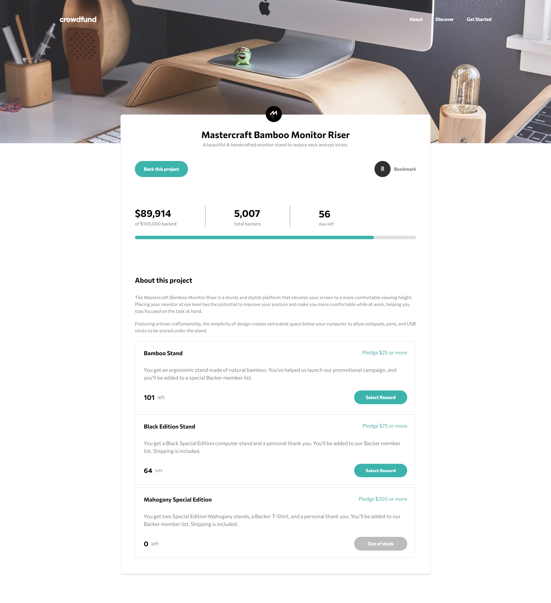
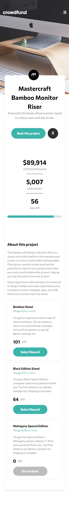
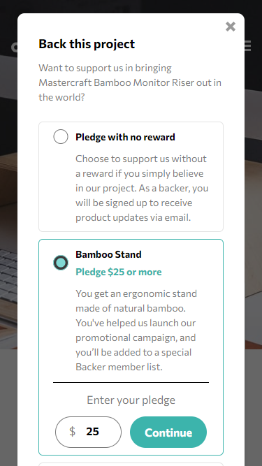

# Crowdfunding product page 
# Frontend Mentor - Crowdfunding product page solution

## Contents

- [Description](#description)
- [Installation](#installation-for-development)
- [Screenshoots](#screenshoots)
- [Demo Crowdfunding Page](#demo-car-hub)

## Description

Discover **Crowdfunding Product Page** – a dynamic showcase of innovative products crafted without React.js and Tailwind CSS. Experience modern technology and engaging design in a streamlined crowdfunding platform.

## Installation for Development

Use the package manager [npm](https://www.npmjs.com/get-npm) to install all required dependecies.
```bash
npm install
```
and then:
```bash
npm run dev
```

## Screenshoots

<div align="center">
    
    
    
    
</div>

## Demo Crowdfunding Page

Let's try it.

<a href="https://dazzling-youtiao-f4dbb4.netlify.app/" target="_blank">
  
</a>
